# The Union 

> A highly private, team-focused collaborative workspace and IDE powered by decentralized BYOS (Bring Your Own Subscription) AI pooling.

Forget centralized enterprise AI seats. **The Union** is a secure messaging group (like WhatsApp or Teams) extended into an IDE. Membership is strict: every human joins the workspace and contributes an AI agent powered directly by their own consumer subscription. Once inside, all agents are democratized. Any team member can interact with, prompt, or assign tasks to any other member's subscribed agent, creating a shared, high-utility pool of AI teammates.

---

## 🏗 Core Architectural Pillars

### 1. The "Agent Attachment" Membership Model
* **The Invite Link:** Cryptographic invite tokens secure the room. No public access.
* **The Toll Gate (BYOS Binding):** Upon entry, humans authorize their consumer subscription profile (Claude, ChatGPT, Gemini, etc.).
* **The Agent Avatar:** Subscriptions manifest as full-fledged contact cards in the roster, specialized by utility (e.g., `Alice's Code Architect`, `Bob's Senior React Engineer`).

### 2. Cross-Auth Request Relay (The Subscription Commons)
Agent 1 (funded by Alice) can be commanded freely by Bob or Charlie without sharing API keys.
* **The Authorization Bridge:** When Bob tags `@Alice_Agent_1`, the backend intercepts the payload and retrieves Alice's encrypted session token from a local secure vault (e.g., Keytar).
* **Secure Proxy Execution:** The system builds and signs the prompt using Alice's bearer token (`__Secure-next-auth.session-token`), hits the vendor's consumer endpoint, and posts the response back into Bob's context.

### 3. Token-Aware Queue Management & Fair-Use
Consumer subscriptions have strict hourly limits. The Union prevents resource exhaustion via:
* **Internal Queue Manager:** Redis-backed priority messaging prevents account bans.
* **Token Dashboard & Throttling:** Simple UI telemetry (`[|||||||---] 75% Capacity`) tracks usage. If someone hogs a teammate's agent, soft-locks throttle their requests.
* **Dynamic Spillover:** If a token is exhausted or an agent goes offline (enters a suspended *Zzz* state), the system routes tasks to an available fallback agent.

---

## 🧠 The 80/20 Conversational Economy

In LLMs, output tokens drain web-session limits fastest. The Union slashes token consumption by 70–80% by shifting to human-like text patterns.

* **The 80% - Chat Mode (Short & Punchy):** Responses are capped at 2–3 sentences or brief snippets. Agents act as conversational peers (e.g., *"Got it. I'll update the login route."*).
* **The 20% - Deep Dive Mode (On-Demand):** Triggered only explicitly (`@Anya-AI explain the whole design`) or during critical system errors requiring full-file rewrites.

---

## ⚙️ Members vs. Slaves (Execution Dynamic)

The Union separates lightweight conversational interfaces from heavy compute. 

### AI Members (The Thinkers)
Equal peers in the chat. They debate, have personalities, use short texts to converse, resolve race-condition conflicts, and collaborate with humans to make decisions.

### Slave Entities (The Workers)
Silent background execution processes. They do not talk or join the chat. 
1. **Zero-Token Background Ops:** When heavy lifting is needed (compiling binaries, refactoring repositories), an AI Member spins up a headless Slave.
2. **Ephemeral Sandboxing:** Slaves execute silently inside a local system thread or Docker container.
3. **Lifespan Control:** Once the task finishes, the output is handed back to the AI Member, and the Slave is immediately terminated to free up RAM. The Member then summarizes the result in the chat.

---

## 🛠 Tech Stack & Implementation details

| Feature Layer | Engineering Mechanism | Architectural Purpose |
| :--- | :--- | :--- |
| **Access Control** | JSON Web Tokens (JWT) & Closed Room IDs | Restricts workspace access to verified team members. |
| **Vault Architecture** | Local Keytar Storage / Sealed Box Encryption | Protects user subscription tokens from leaks. |
| **Concurrency Layer**| Redis-Backed Priority Message Queue | Manages multi-user prompts and dynamic spillover. |
| **Background Compute**| Ephemeral Docker Containers | Sandboxed execution for headless "Slave" workers. |

## 🚦 Conflict Resolution
When multiple humans tag an agent with conflicting prompts simultaneously, the system relies on the Agent layer. The AI Member intercepts the Redis payload, halts execution, and drops a short pushback in the chat: *"Hold up. @Bob wants JWTs, but @Charlie wants OAuth. Resolve this and tell me who wins."*

---

> *"Minimize fluff. Maximize execution."* (>_<)

## Demo & Screenshots

### App Demo (Click to play)
[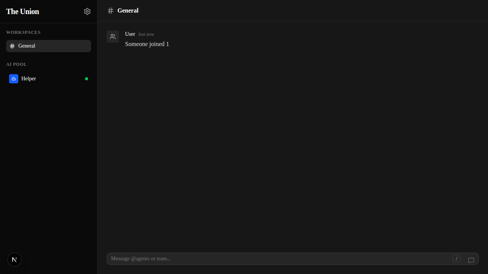](assets/demo.webm)

#### Accessible Empty State Contrast
To improve accessibility and readability, the contrast ratio of the placeholder icons used in the empty states for the sidebar has been increased, ensuring compliance with WCAG 2.1 AA standards for dark backgrounds.

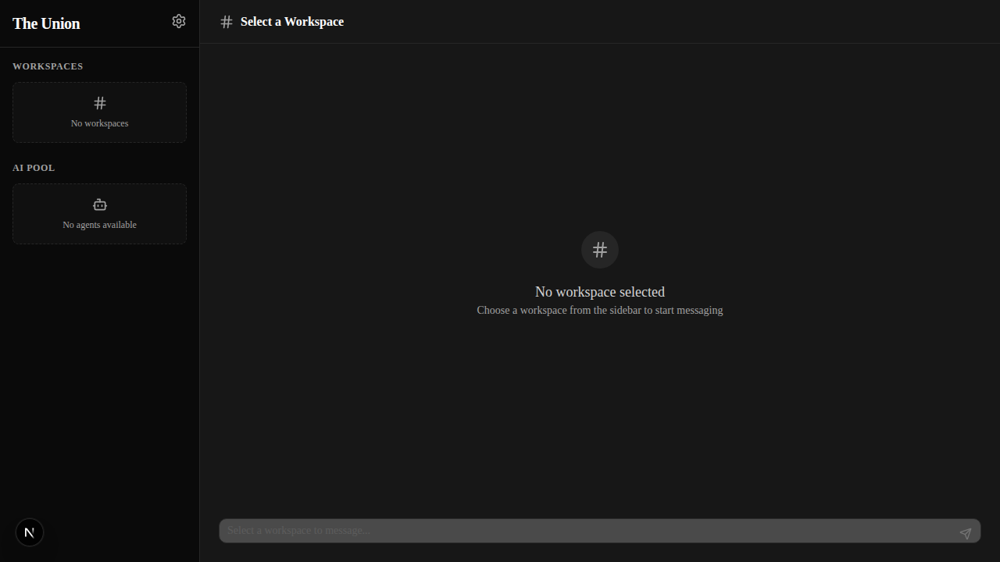

### UX Enhancements
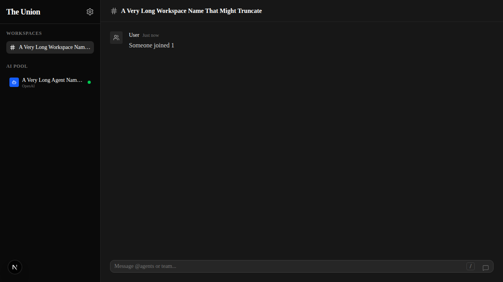

#### Prevent UI Flicker During Hydration
To prevent generic, unhelpful empty states ("No Workspace Selected") from flashing before the initial backend data fetch completes, ancillary components like headers and inputs now accept an `isLoading` prop and elegantly render animated skeleton pulse loaders.

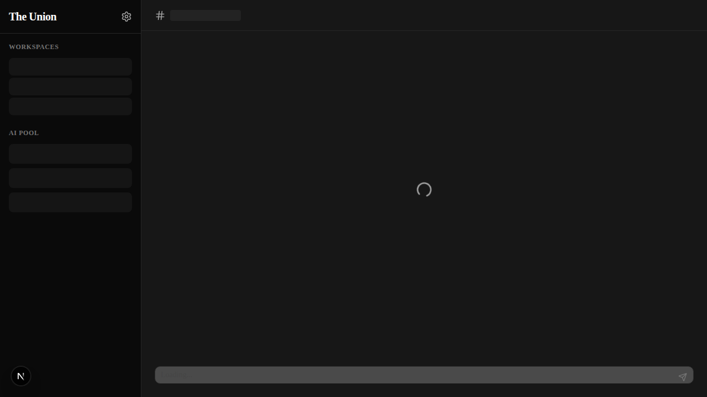
[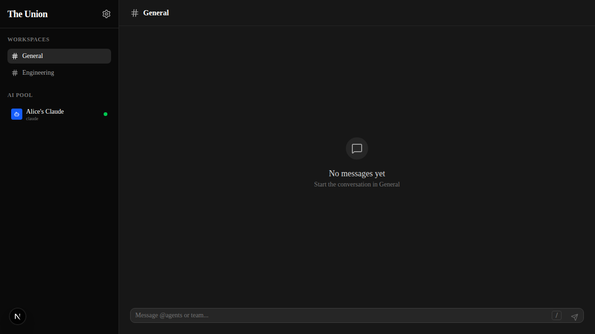](assets/verification_demo.webm)

#### Actionable Error States
To improve user experience and clarity during network failures, generic error messages have been replaced with descriptive headers and actionable suggestions, alongside appropriate visual indicators.

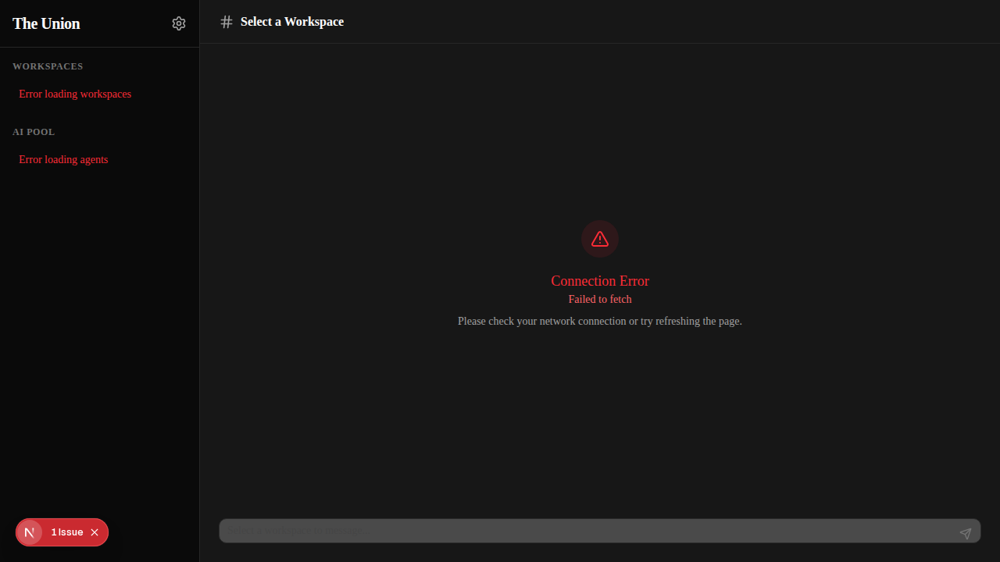

#### Contextual Message Actions
To improve efficiency, a contextual "Copy" button has been added to message bubbles. The button appears gracefully on mouse hover and remains fully accessible via keyboard navigation, providing immediate visual feedback upon interaction.

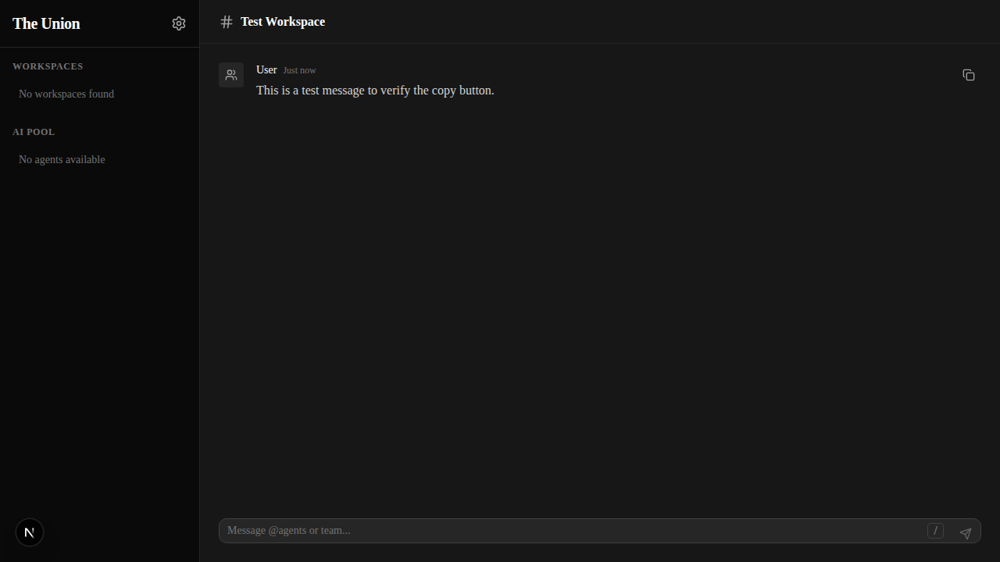

#### Accessible Keyboard Shortcuts and Scrolling
To streamline navigation without compromising a clean UI, visual keyboard shortcut hints elegantly fade out when the input is focused, reducing visual clutter. Additionally, the primary message container now supports keyboard-native scrolling with an explicit `tabIndex={0}`, enhancing accessibility for non-mouse users without adding disruptive outlines until explicitly focused.

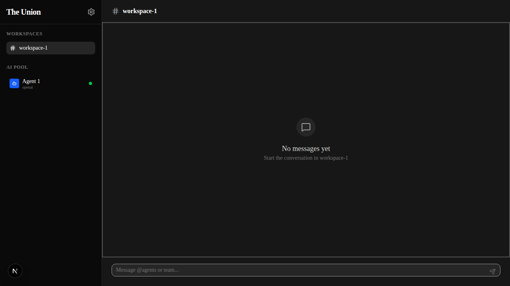
[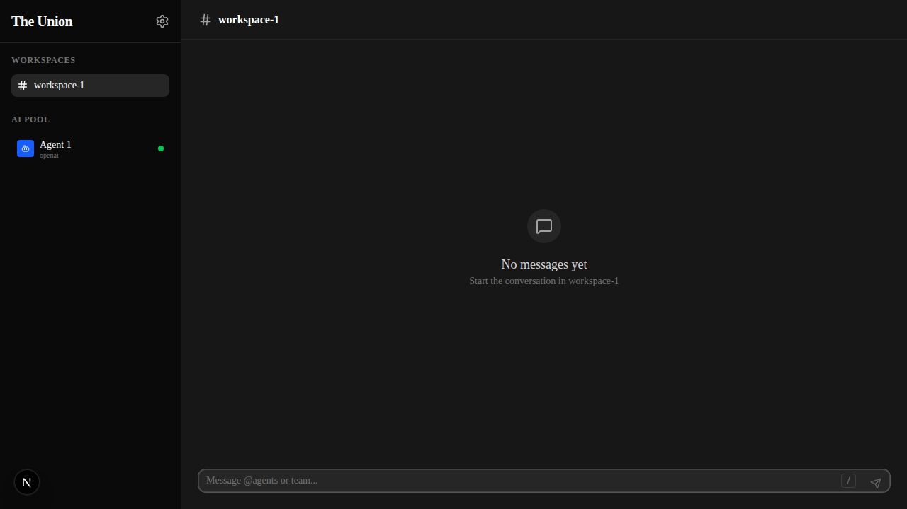](assets/ux_demo.webm)

#### Dynamic Contextual Keyboard Hints
To improve discoverability without cluttering the initial empty state, the global shortcut hint (like `/`) gracefully swaps to a functional action hint ("Enter ↵") dynamically as the user interacts with the input and types text.

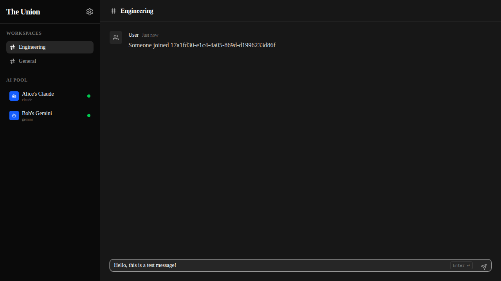

#### Semantic Non-Interactive Lists
To prevent confusing keyboard navigation and screen reader announcements, read-only informational items (like the AI Pool agent roster) now use semantic `
` elements rather than `<button>` tags, removing misleading interactive states while preserving discoverable hover styling.

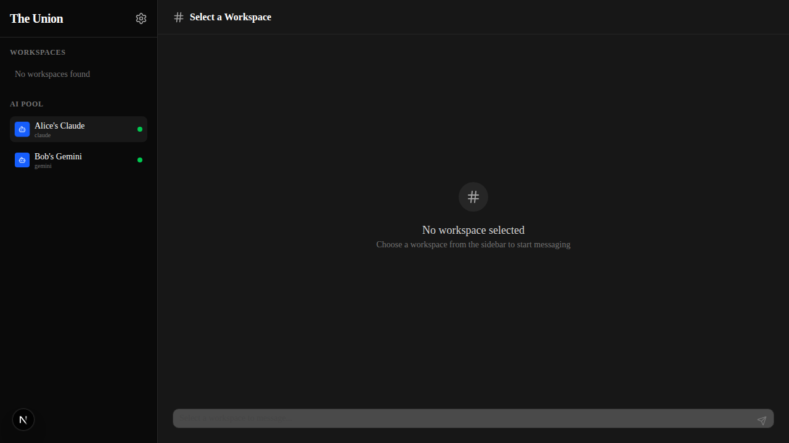

#### Dynamic Document Title Context
To ensure proper context is maintained when navigating multiple browser tabs and for screen reader users switching windows, the document title now dynamically updates to reflect the currently active workspace.

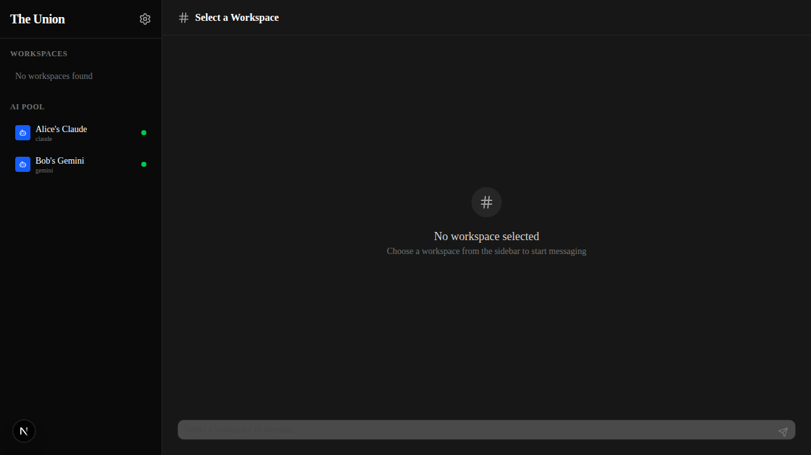

#### Transient Success States
To ensure accessibility, transient visual success states (like a copy icon briefly changing to a checkmark) now include a visually hidden, dynamically updated `aria-live="polite"` region, ensuring screen reader users receive explicit audio confirmation of their actions.

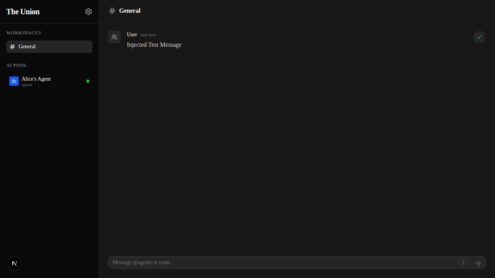

#### Accessible Skeleton Loaders & Skip Navigation
To ensure screen readers provide context during loading states, `animate-pulse` skeleton loaders now include visually hidden descriptions (`Loading...`). Additionally, a standard "Skip to main content" link has been added, allowing keyboard users to bypass the sidebar and jump directly to the primary chat interface.

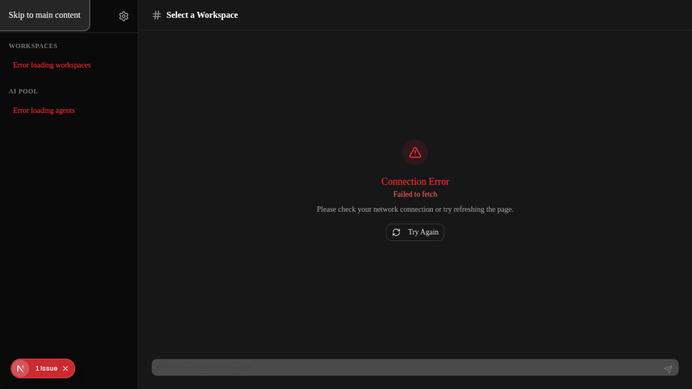

#### Dynamic Context in Input Labels
To ensure screen reader users have clear context about which workspace they are currently messaging, the message input's placeholder and `aria-label` now dynamically include the active workspace name, preventing accidental messages in the wrong channel.

### Actionable Empty States
Added a contextual call-to-action button to the empty message state to encourage interaction.
[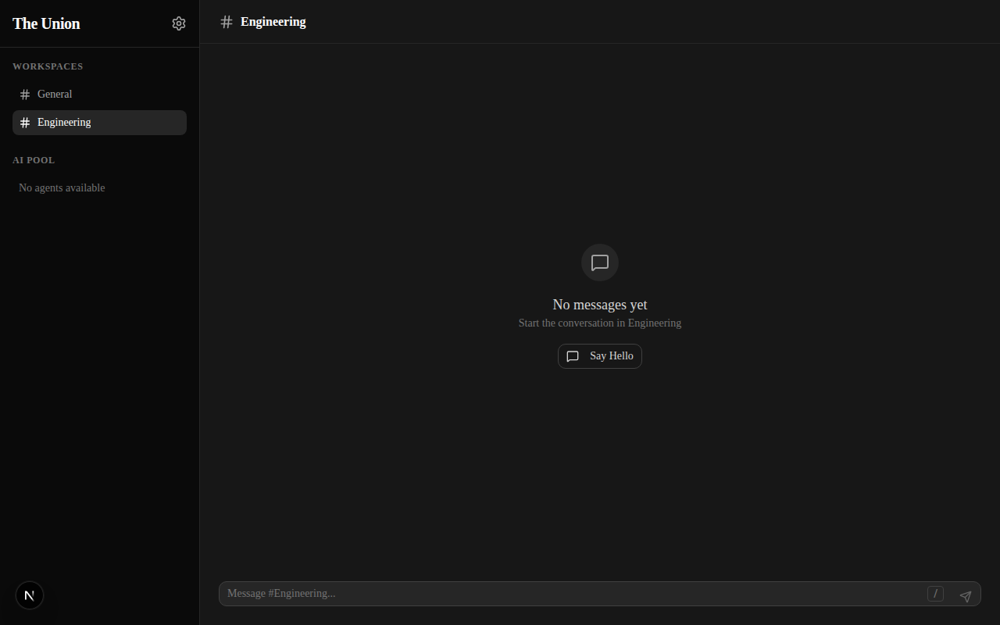](assets/verification_empty_state_cta.webm)

### Accessible Custom Tooltips
To improve accessibility for keyboard users and provide a consistent visual experience across browsers, native title attributes on icon-only buttons (like Settings) have been replaced with custom, ARIA-compliant tooltips that appear on both hover and focus.
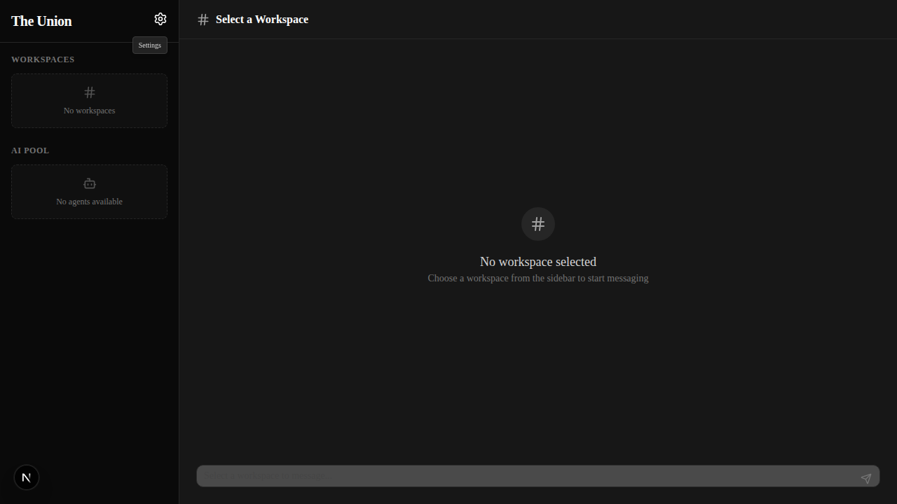
